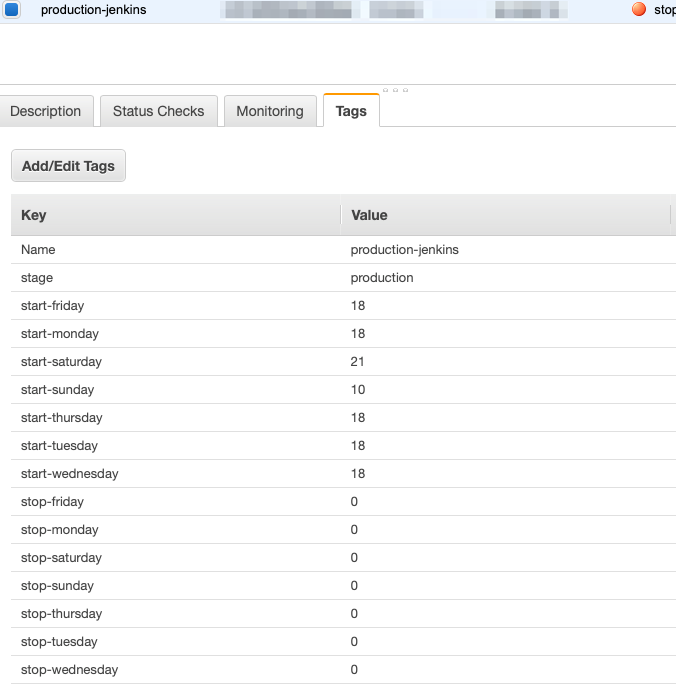

# AWS account tools serverless
This project is intended to create a fully serverless infraestructure for AWS account management using some utils functions such as start-stop instances batches, backup creation-retention... and so on.

## Resources
The **AWS account tools serverless** will create a *cloudformation stack* with all the necessary artifacts:
* Several AWS lambda functions
* IAM role permissions
* Cloudwatch log streams
* Cloudwatch event rules for scheduling actions

## Requirements
This project was made with the serverless framework with several plugins and uses python as main development language, so you need:
* Python3 (for local development)
    * pytz package
* nodejs
* npm
* serverless framework
    * serverless-pseudo-parameters plugin
    * serverless-python-requirements plugin

    
    

## Current services
* Start and stop EC2 instances in a week / hour basis schedule

### EC2 start-stop instances
The workflow is very simple. Every **30 minutes** a cloudwatch event will trigger a lambda function that scans each region or a defined one in the AWS account looking for EC2 instances that match the start or stop criteria.

This criteria is based on three tags that must be attached to the instances:
* **stage**: must be the same which the schedule system was deployed
* **start**: start hour (24 hours format) in which the instance must be started for each weekday
* **stop**: stop hour  (24 hours format) in which the instance must be stopped for each weekday
* **instance state**: if instance must to be stopped, the system will check that instance current state is 'running' and if instance must be started the instance state is expected to be 'stopped'

Pay attention on the **timezone** where you put your instances start and stop tags. A default timezone is setted in the **serverless.yml** file, if you want to use a different one, please change this value.

### Tags format
As described below, the system will filter existing instances based in the tags attached to the EC2 instances.

Here is an example of tags format:

The start tags are composed by the string 'start' followed by a hyphen and the weekday name like this:

`start-monday`

The stop tags has exactly the same format.

All values for start and stop tags are simple numbers indicating only the hour (in 24h format) where the instance is expected to be starterd or to be stopped.

If you don't want to schedule a start or stop for a particular day, just only remove the start and stop tag for this. For example if you only want to operate with the instance only on monday, your tags may look like this:

## Deployment
When you want to deploy the **AWS account tools serverless** you must specify at least the AWs credentials needed to deploy to the AWS account with permissions enough to create any necessary resource described in the [resources section](#resources).

It is strongly recommendend that you explicity specify also **region** and **stage** parameters in the deploy action.

`serverless deploy --aws-profile my-profile --region eu-west-1 --stage production`